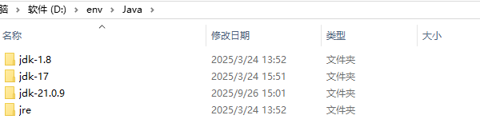
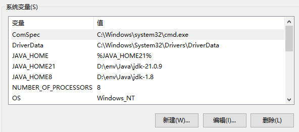
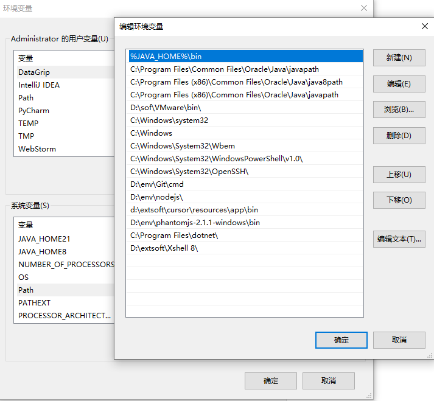

# JDK多版本控制【Windows】
本地环境中想安装使用多个版本的jdk，每次卸载旧的，按照新的比较麻烦！可以通过配置环境变量的方式实现多个版本的切换！

## Step.1
可以将下载的jdk不同的版本文件目录统一放在一个目录文件夹下！

## Step.2
配置环境变量。在环境变量中根据不同版本的JDK，创建不同的 `JAVA_HOME版本号`，如`JAVA_HOME8`、`JAVA_HOME17`、`JAVA_HOME21`。
然后，创建变量`JAVA_HOME`用来选择当前需要使用的JDK版本。

编辑 path，新建配置`%JAVA_HOME%\bin`,创建好后，path就可以不用在动了！如果需要新的版本引入，下载后解压到统一的存放目录下，新增`JAVA_HOME版本号`，修改`JAVA_HOME`的变量值为需要激活的版本，应用确定即可！

