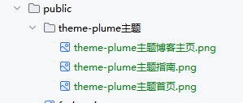

## 官网教程
<Swiper :items="['./theme-plume/theme-plume主题首页.png','./theme-plume/theme-plume主题指南.png','./theme-plume/theme-plume主题博客主页.png']" effect="creative" :creativeEffect="{
prev: { shadow: true, translate: ['-125%', 0, -800], rotate: [0, 0, -90] },
next: { shadow: true, translate: ['125%', 0, -800], rotate: [0, 0, 90] },
}"
/>

我也只是看着官网一步一步部署的！

### [官网教程非常详细](https://theme-plume.vuejs.press/)

## 总结一些踩坑建议

### 1.轮播图

⚠️要在Markdown中使用轮播图时,图片的地址可以存在本地也可使用线上地址。
> 本地的地址需要放在./vuepress/public/ 文件夹下面



```html title="Markdown文件中"
<Swiper 
        :items="['./theme-plume主题/theme-plume主题首页.png','./theme-plume主题/theme-plume主题指南.png','./theme-plume主题/theme-plume主题博客主页.png']"
        effect="fade"
        :height="400"
/>
```

> 线上地址，提供可访问的图片链接即可，oss、cos、图床等！

```html title="Markdown文件中"
<Swiper
        :items="['https://p.sda1.dev/29/dc1be6a93a5d0cf5d8d3549d47750901/1.JPG','https://p.sda1.dev/29/dc1be6a93a5d0cf5d8d3549d47750901/2.JPG','https://p.sda1.dev/29/dc1be6a93a5d0cf5d8d3549d47750901/3.JPG']"
        effect="fade"
        :height="400"
/>
```

### 2.网站图标 favicon

可以在 `./vuepress/config.ts` 中修改。可以使用在线链接，也可使用本地静态图片(在 `./vuepress/public/`下可不用写路径)

```javascript title="config.ts"
export default defineUserConfig({
    head: [
// ['link', { rel: 'icon', href: 'https://youke2.picui.cn/s1/2025/12/18/69436b735090b.ico'}],
        ['link', {rel: 'icon', href: 'favicon.ico'}],  // favicon.ico位置在public中
    ],
})
```